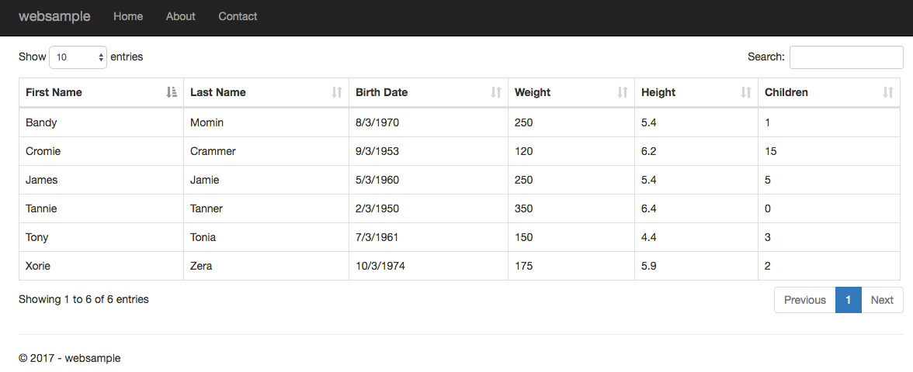

C# datatables parser
========================

A C# .Net Core Serverside parser for the popuplar [jQuery datatables plugin](http://www.datatables.net) 

Supported Platforms
==========================
The parser aims to be Database and Provider agnostic. It currently targets Netstandard 1.3. The solution includes tests for:
* Entity Framework Core
  * In Memory
  * MySql 
  * Sql Server 

jQuery Datatables
========================

The jQuery Datatables plugin is a very powerful javascript grid plugin which comes with the following features out of the box:

* Filtering
* Sorting
* Paging
* Themes
* Plugins  
* Ajax/Remote and local datasource support

Using the Parser
========================

Please see the [official datatables documentation](http://datatables.net/release-datatables/examples/data_sources/server_side.html) for examples on setting it up to connect to a serverside datasource.

The following snippets were taken from the aspnet-core-sample project also located in this repository

**HomeController.cs**

    public class HomeController : Controller
    {
        private readonly PersonContext _context;

        public HomeController(PersonContext context)
        {
            _context = context;
        }
        public IActionResult Index()
        {
            return View();
        }

        public IActionResult Data()
        {
            var parser = new Parser<Person>(Request.Form, _context.People);

            return Json(parser.Parse());
        }
    }

**Startup.cs**

        public IServiceProvider ConfigureServices(IServiceCollection services)
        {
        
            services.AddDbContext<PersonContext>(options => options.UseInMemoryDatabase("aspnet-core-websample"));

            services.AddMvc()
                    .AddJsonOptions(options =>
                    {
                        options.SerializerSettings.ContractResolver = new DefaultContractResolver();
                    });
                    
            return services.BuildServiceProvider();
        }

**Index.cshtml**

        @{
            ViewData["title"] = "People Table";
        }

        <h2>Index</h2>
        <table class="table table-bordered " id="PeopleListTable"></table>

        @section Scripts
        {
            

        }

The included Dockerfile-websample builds, packages and runs the web sample project in a docker image. No tools, frameworks or runtimes are required on the host machine. The image has been published to docker for your convenience.  

    docker run -p 80:80 garvincasimir/datatables-aspnet-core-sample:0.0.2      

Installation
========================
 
**Visual Studio**

You can search using the NuGet package manager, or you
can enter the following command in your package manager console:
 
    PM> Install-Package DatatablesParser-core      

**Visual Studio Code** 

Use the built in terminal and run the following command:

    dotnet add package DatatablesParser-core 

Testing
=========================
This solution is configured to run tests using xunit. However, the MySql and Sql Server entity tests require a running server. You can use the included docker-compose-test.yaml to run all the unit and integration tests.

     docker-compose -f docker-compose-test.yaml up --force-recreate --exit-code-from test-runner --build test-runner

Contributions, comments, changes, issues
========================

I welcome any suggestions for improvement, contributions, questions or issues with using this code.

* Please do not include multiple unrelated fixes in a single pull request
* The diff for your pull request should only show changes related to your fix/addition (Some editors create unnecessary changes).
* When possible include tests that cover the features/changes in your pull request
* Before you submit make sure the existing tests pass with your changes
* Also, issues that are accompanied by failing tests will probably get handleded quicker

Contact 
========================
Twitter: [garvincasimir](https://twitter.com/garvincasimir)
Google+: [garvincasimir](https://plus.google.com/100137710586918559017)
